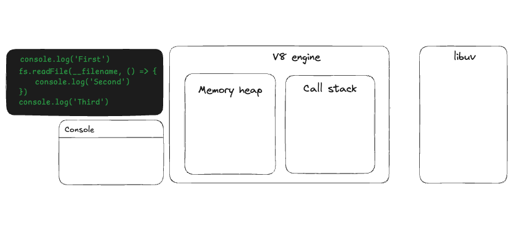

# Event loop

The event loop is what allows Node.js to perform non-blocking I/O operations —
despite the fact that a single JavaScript thread is used by default — by
offloading operations to the system kernel whenever possible.
It is a C programm and a part of libuv. It has a design pattern that orchestrates or co-ordinates the execution of synchoronous and asynchronous code in Node.js

## Asynchronous Javascript

Javascript is synchronous, blocking, single-threaded language

#### Blocking

No matter how long a previous process takes, the subsequent processes won't kick
off until the former is completed

#### Single threaded

A thread is simply a process that your JavaScript program can use to run a task.
Each thread can do only one task at a time. Javascript has just one thread
called the main thread for executing any code

## Memory heap

The V8 memory heap refers to the memory management system used by the V8
JavaScript engine, which powers Node.js and Google Chrome's JavaScript
execution. It's where V8 allocates and stores JavaScript objects and dynamic
data. In V8 JavaScript, the data types stored in the memory heap are primarily
the reference types. Here's a simple breakdown:

1. Objects
2. Arrays
3. Functions
4. Strings (except for some short strings that may be optimized differently)
5. Dates
6. RegExp objects
7. Map and Set objects
8. Custom types you define

#### The heap is divided into 3 different spaces:

- There's a section for new items (young generation)
- A section for items that have been around longer (old generation)
- A special area for really big items (large object space)

  
Memory heap spaces

  <ol>
    <li><strong>New Space (Young Generation):</strong>
      <ol>
        <li>
          <strong>Purpose:</strong> The new space is where most objects are initially allocated. It is relatively small and optimized for short-lived objects.
        </li>
        <li>
          <strong>Subdivisions:</strong>
          <ol>
            <li>
              <strong>Eden Space:</strong> Newly created objects are first allocated here.
            </li>
            <li>
              <strong>Survivor Spaces:</strong> Objects that survive a garbage collection cycle in the Eden
              space are moved to one of the two survivor spaces (from-space and to-space).
            </li>
          </ol>
        </li>
        <li>
          <strong>Garbage Collection:</strong> Minor garbage collections happen frequently in the new space
          to free up memory. If an object survives several minor collections, it is promoted to the old space.
        </li>
      </ol>
  </li>

  <li>
    <strong>Old Space (Old Generation):</strong>  
    <ol>
      <li>
        <strong>Purpose:</strong> The old space holds objects that have lived long enough in the new space to be considered long-lived.
      </li>
      <li>
        <strong>Subdivisions:</strong>
        <ol>
          <li>
            <strong>Old Pointer Space:</strong> Stores objects with references to other objects.
          </li>
          <li>
            <strong>Old Data Space:</strong> Stores objects with references to other objects.
          </li>
        </ol>
      </li>
      <li>
        <strong>Garbage collection:</strong> Major garbage collections are less frequent and more costly. The objects here are often deeply rooted in the application and are not collected often
      </li>
    </ol>
  </li>

  <li>
    <strong>Large Object Space:</strong>
    <ol>
      <li>
        <strong>Purpose:</strong> Objects that are too large to fit into the new space are allocated here
      </li>
      <li>
        <strong>Garbage collection:</strong> Objects in this space are individually managed and garbage collected.
      </li>
    </ol>
  </li>
</ol>

  
## libuv
libuv is a cross platform open source library written in C language. It handles
asynchronous non-blocking operations on Node.js.

## Synchronous

## Asynchronous

## Questions

<ol>
  <li>
  Whenever an async task completes in libuv, at what point does Node decide to run the associated callback function on the call stack?
  

    
answer

    Callback functions are executed only when the call stack is empty. The normal flow of execution will not be interrupted to run a callback function
  

  </li>

  <li>
  What about async methods like setTimeout and setInterval which also delay the execution of a callback function?
  

    
answer

    setTimeout and setInterval callbacks are given first priority
  

  </li>

  <li>
  If thwo async tasks such as setTimeout and readFile complete at the same time, how does Node decide which callback function to run first on the call stack?
  

    
answer

    Timer callbacks are executed before I/O callbacks even if both are ready at the exact same time
  

  </li>
</ol>

1. Any callbacks in the micro task queues are executed. First, tasks in the nextTick queue and only then tasks in the promise queue
2. All callbacks within the timer queue are executed
3. Callbacks in the micro task queues if present are executed. Again, first tasks in the nextTick queue and then tasks in the promise queue
4. All callbacks within the I/O queue are executed
5. Callbacks in the micro task queues if present are executed. nextTick queue followed by
Promise queue
6. All callbacks in the check queue are executed
7. Callbacks in the micro task queues if present are executed. Again, first tasks in the nextTick queue and then tasks in the promise queue
8. All callbacks in the close queue are executed
9. For one final time in the same loop, the micro task queues are executed. nextTick queue followed by promise queue
